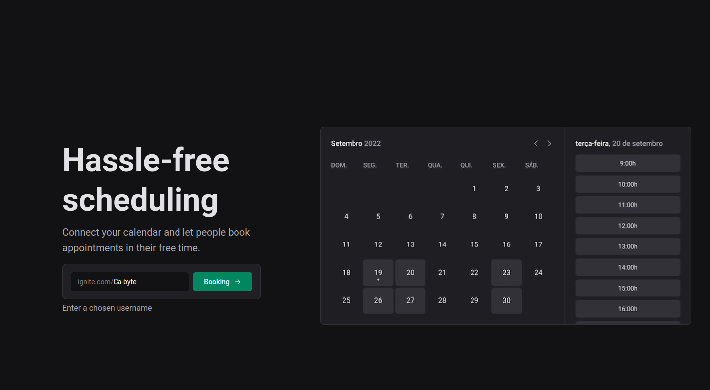
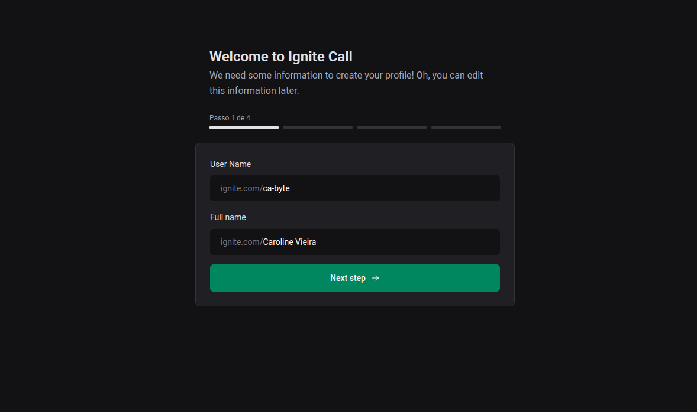
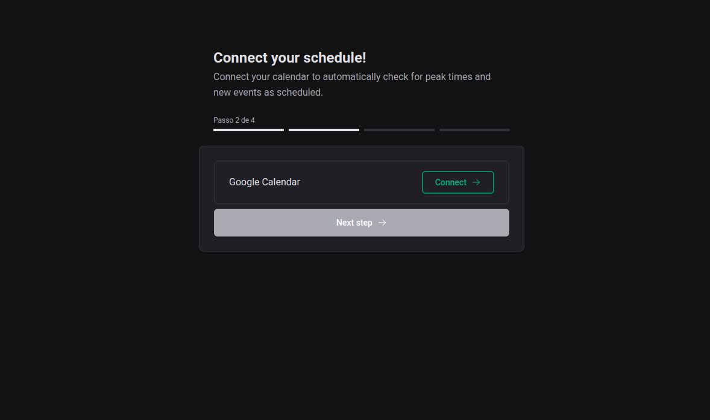
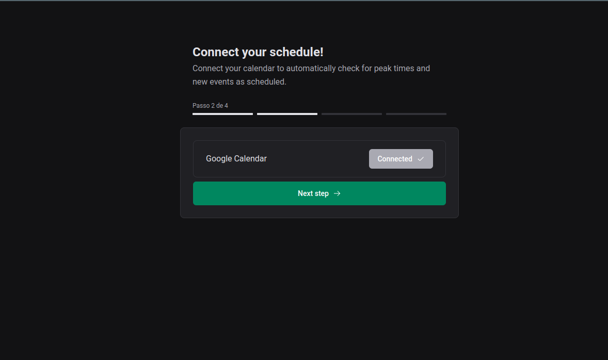
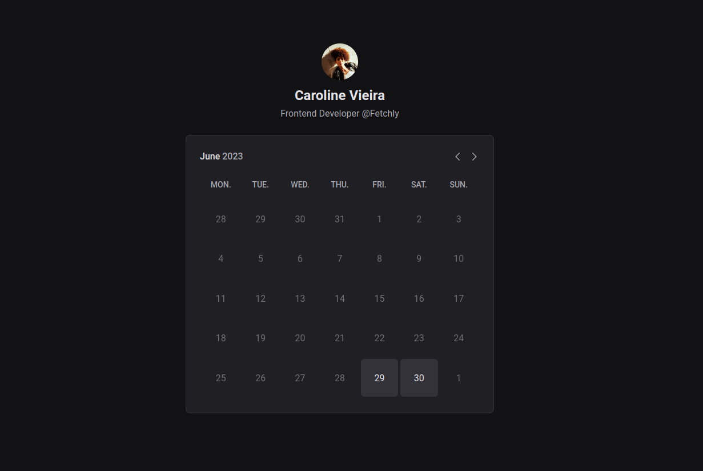
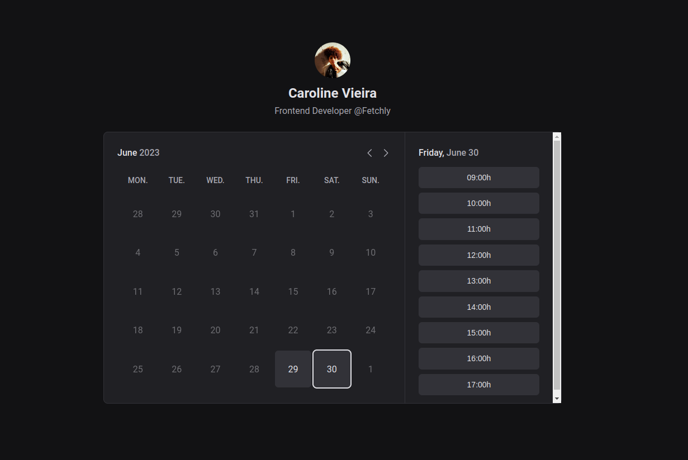
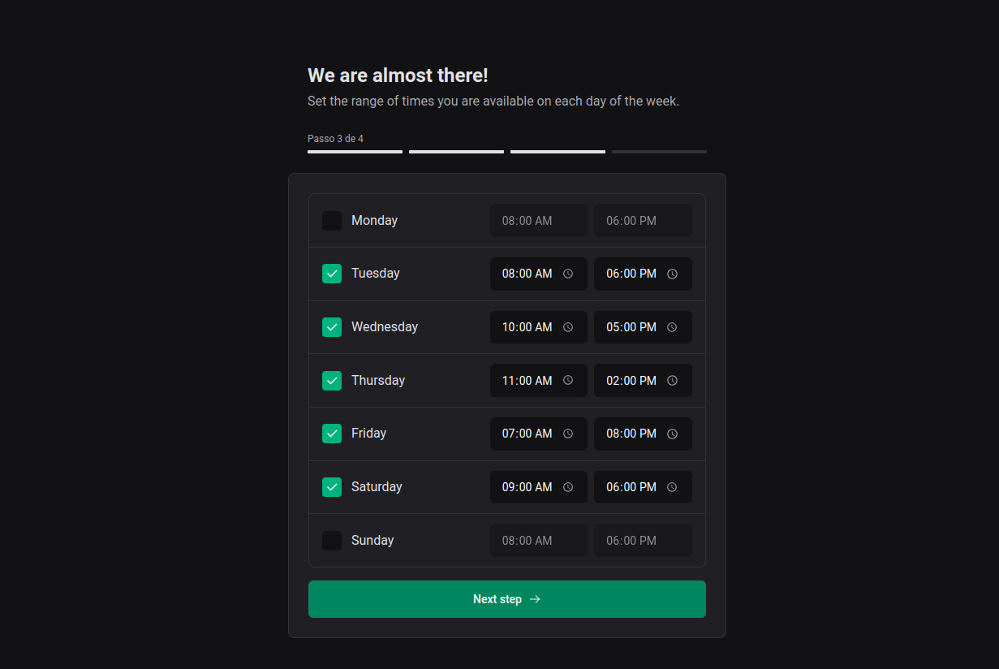
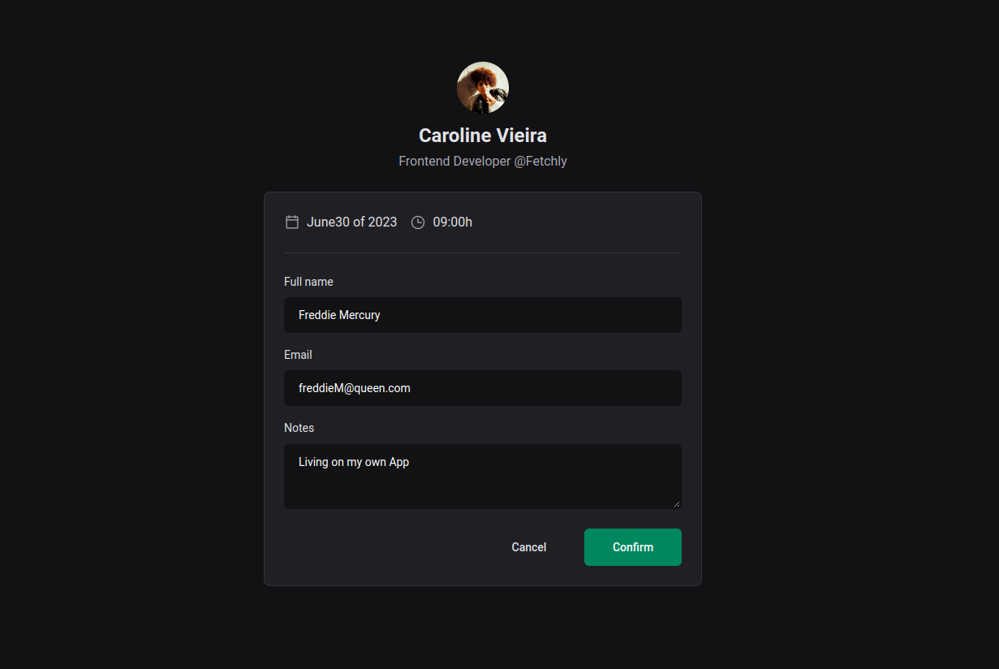
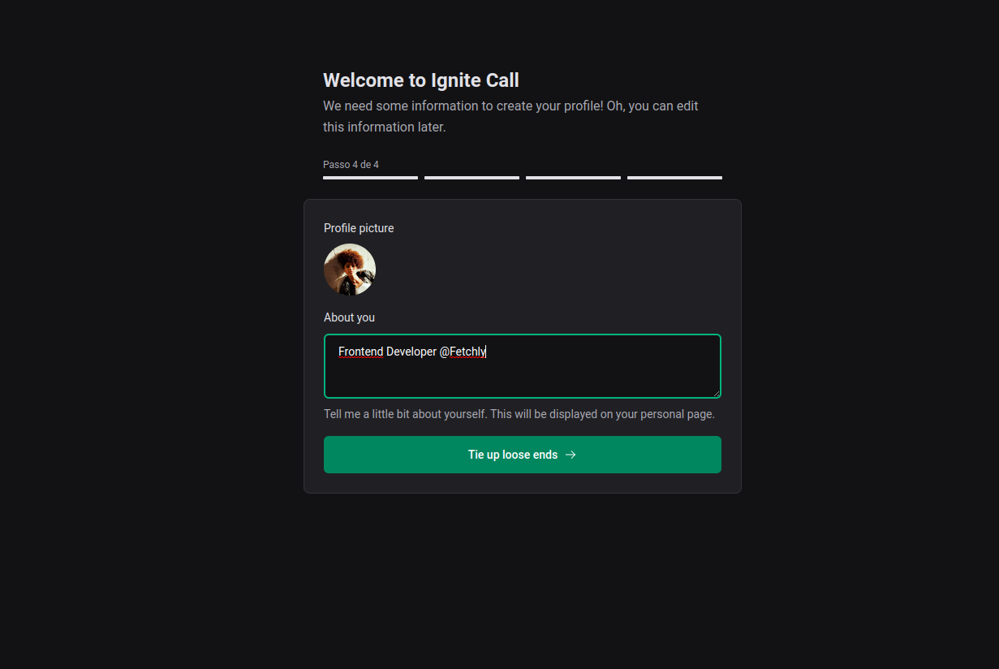
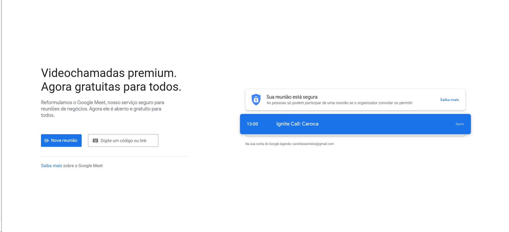

<div style="text-align: center;">
  
  
  
  
  
  
  
  
  
  
     
</div>

<div style="text-align: center;">
  <a href="#memo-project">Project</a>&nbsp;&nbsp;&nbsp;|&nbsp;&nbsp;&nbsp;
  <a href="#rocket-technologies">Technologies</a>&nbsp;&nbsp;&nbsp;|&nbsp;&nbsp;&nbsp;
  <a href="#clipboard-requirements">Requirements</a>&nbsp;&nbsp;&nbsp;|&nbsp;&nbsp;&nbsp;
  <a href="#keyboard-how-to-run-the-project ">How to run the project </a>&nbsp;&nbsp;&nbsp;|&nbsp;&nbsp;&nbsp;
  <a href="#art-layout">Layout</a>&nbsp;&nbsp;&nbsp;|&nbsp;&nbsp;&nbsp;
</div>
<br>

---

## :memo: Project 

Overall, this project involves building a full-stack application using React.JS and Next.js framework, integrating Google Calendar for calendar functionality, using Prisma for efficient database interactions, implementing a design system for consistent UI/UX, writing SQL queries directly, handling routing, validating data with Zod, and deploying the application using Vercel and database using PlanetScale. This combination of technologies allows us to create a robust and scalable application with a modern and user-friendly interface.

This is a project developed during React bootcamp **[Ignite](https://github.com/Rocketseat)**, run by **[@Rocketseat](https://github.com/Rocketseat)**.

<br>

---

## :rocket: Technologies ##

This project was developed using the following technologies:

- [React](https://pt-br.reactjs.org/)
- [Next](https://nextjs.org/)
- [Next-auth](https://next-auth.js.org/)
- [Next-seo](https://github.com/garmeeh/next-seo)
- [TypeScript](https://www.typescriptlang.org/)
- [Styled-components](https://styled-components.com/)
- [Google-apis](https://developers.google.com/apis-explorer)
- [Zod](https://github.com/colinhacks/zod/)
- [React Hook Form](https://react-hook-form.com/)
- [Phosphor](https://phosphoricons.com/)
- [Axios](https://axios-http.com/docs/intro)
- [Dayjs](https://day.js.org/)
- [Prisma](https://www.prisma.io/)
- [Nookies](https://github.com/maticzav/nookies)
<br>

---

## :clipboard: Requirements

Before starting you need :checkered_flag:, have installed the [Git](https://git-scm.com) e [Node](https://nodejs.org/en/).
You will need to install docker, please do not say you are using Windows :( [Install Docker Engine on Ubuntu](https://docs.docker.com/engine/install/ubuntu/)

<br>

---
## :keyboard: How to run the project ##

```bash
# Clone this project
$ git clone git@github.com:Ca-byte/ignite_call.git

# Access
$ cd ignite-call

# Install dependencies
$ npm i

# Run the project
$ npm run dev

# Run the prisma studio
$ npx prisma studio


# Run docker/check/stop => linux(sudo)
$ sudo docker start mysql  
$ sudo docker ps 
$ sudo docker stop mysql  


# The server will initialize in the <http://localhost:3000/>

```
<br>

---


## :art: Layout ##

- [Ignite Call](https://www.figma.com/file/6rvqoxGGKfpeQpNsx3CTf4/Ignite-Call-(Community)?type=design&node-id=0-1&mode=design&t=j4zCsewMrFAQwJan-0)

Remembering that you need to have a [Figma](http://figma.com/) account to access it.

---


<br>

<a href="#top">☝</a>

<p style="text-align: center;">Developed with 💜 by Caroline Vieira</p>
